# Criando o projeto na GCP
- Uma vez que você possua uma conta na GCP pronta para usar os US$ 300,  o primeiro passo necessário é a criação de um projeto. Embora também seja possível a utilização deste que já vem criado.  

- Todo e qualquer recurso, mesmo aqueles que estão no free tier, para serem habilitados necessitam que haja uma conta de faturamento (billing account).

- Para o caso, vamos considerar que você pretende usar os US$ 300 de crédito, esse valor será depositado justamente em uma Billing Account que você criará durante o cadastro.

- Para criar o projeto, dentro do console, faça:
    - No canto superior esquerdo, clique em `Selecione um projeto`.
    - Na caixa que abrir, no canto superior direito, clique em `Novo Projeto`
    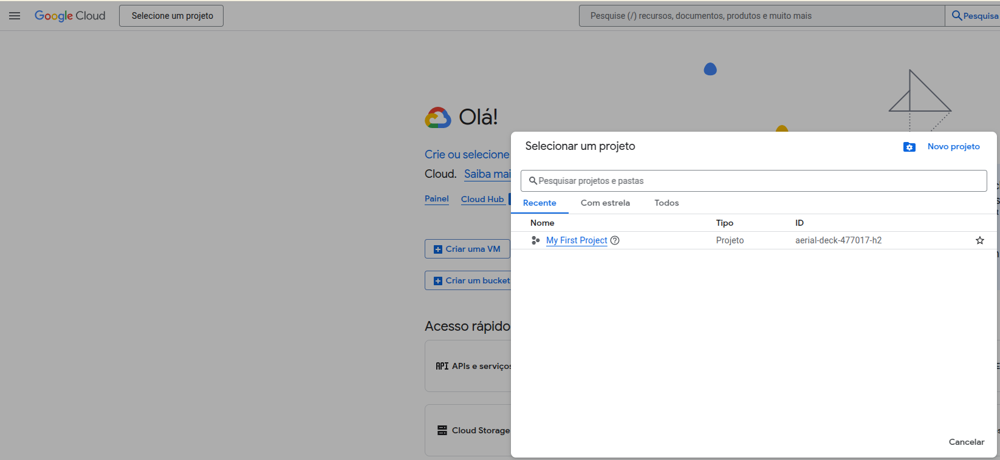

- Então, na página que exibir, faça:
    - Defina um nome para o projeto.
    - Clique em criar.
    - Não é necessário definir uma Organização.
    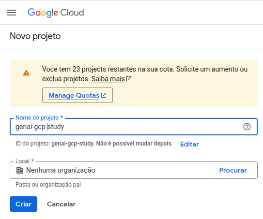

- Uma vez que o projeto foi criado, uma página abrirá, e o ícone no canto superior direito ficará verde, indicando que o projeto foi criado com sucesso.
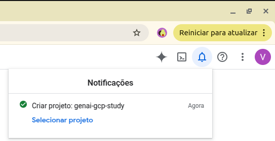

# Ativando o Vertex
- Uma vez que foi criado o projeto, e selecionado para uso o projeto recém criado, para ativar o Vertex no projeto, faça:
    - Na caixa de texto central, pesquise por `Vertex`, e selecione a opção `Vertex AI`:
    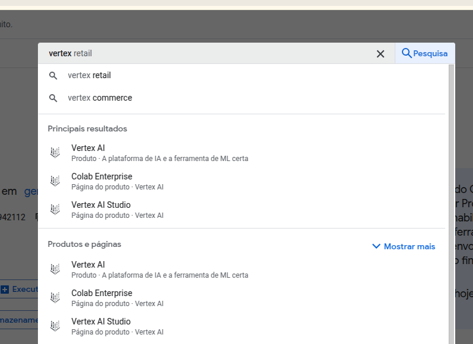

- Na página que abrir em sequência, clique em `Ativar APIs` para habilitar o vertex ao projeto:
    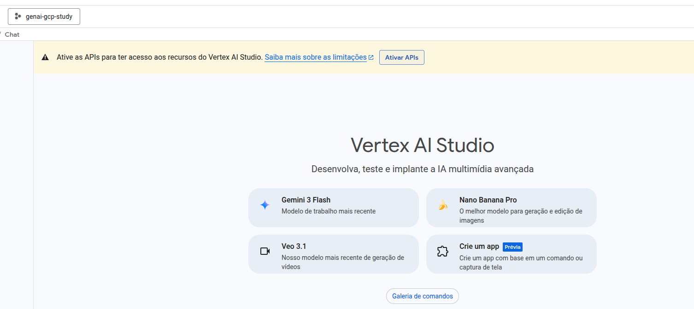

- Na página que abrir em sequência, clique em `Ativar` para ativar as apis obrigatórias para uso da ferramenta:
    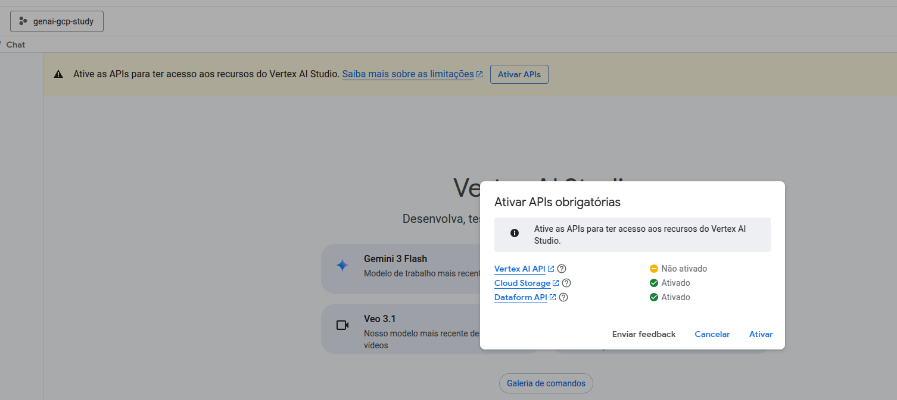

- Isso pode levar alguns segundos.

# Autenticação e Segurança
- Uma vez que o vertex, neste repositório, será utilizado através do python, será necessário criar uma Conta de Serviço (ou uma `Service Account`) para acessar os recursos do Projeto (no caso, o vertex) do projeto na cloud.

- Para criar uma __Conta de Serviço__, vá em "IAM e Administrador" > "Contas de serviço",
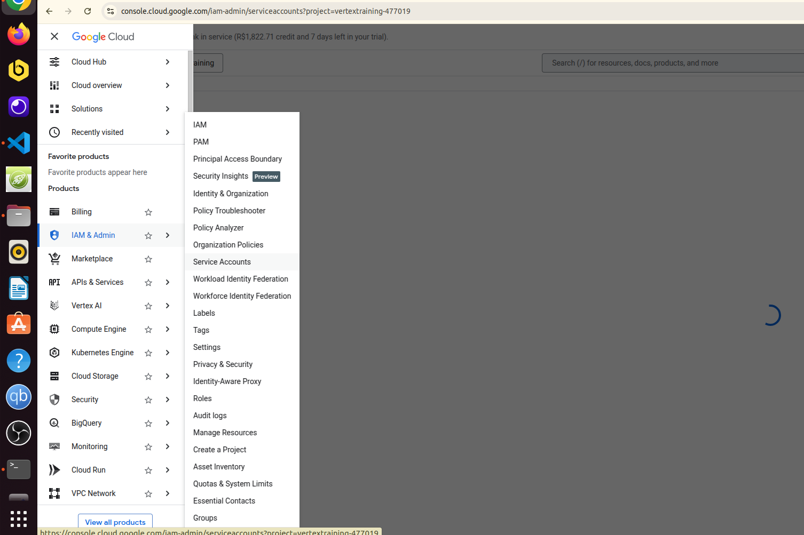

- Uma vez na página que se abrirá, clique em `+ Create Service Account`:
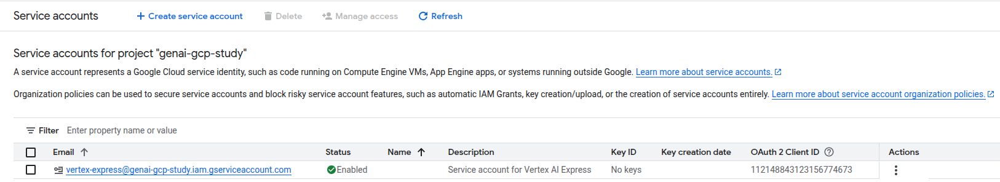

- Para criar a `Service Account`, dê um nome descretivo e forneça sua necessidade de uso, clique em `Create and Continue`:
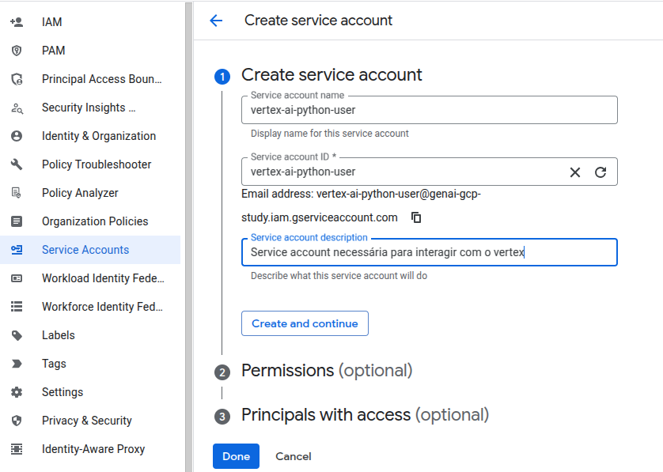

- Agora será necessário definir uma Role, que nada mais é do que a permissão que o usuário tem com esta Service Account. Procure por Vertex, e aplique a role `Vertex AI User`. Desta forma, com essa service account será possível usar o Vertex, e nada mais do que isso, aplicando desta forma o princípio do "menor privilégio".
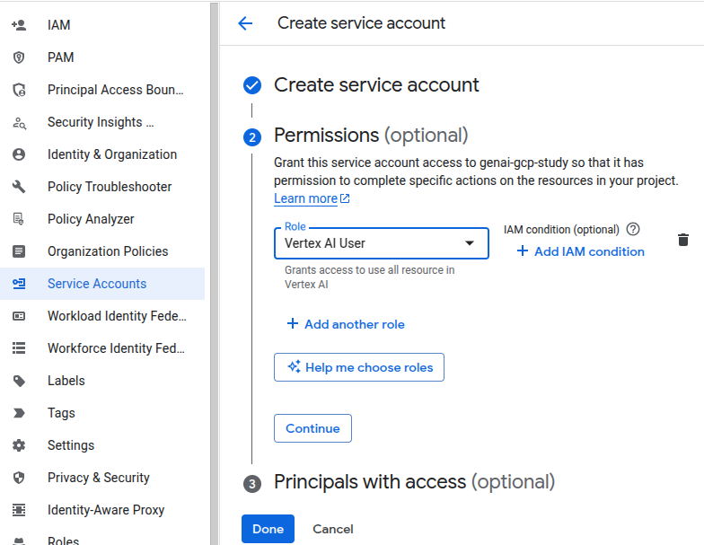

- Clique em `Continue` e `Done`.

## Gerar Chave de Acesso
Agora você precisa das credenciais, para poder utilizar o "Vertex" em sua máquina local, e criar o seu robo.

- Na lista de contas de serviço, clique no endereço de e-mail da conta que você acabou de criar.
    - 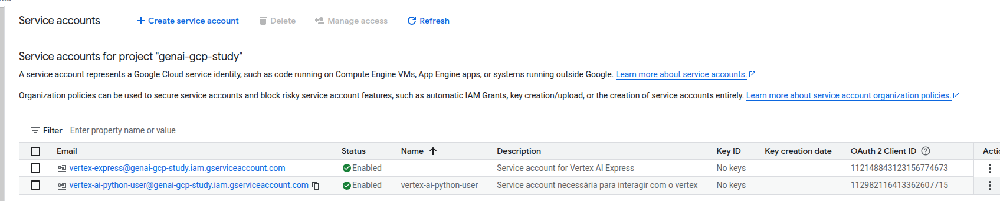

- Na tela relacionada à `Service Account`, na aba `Keys`, clique no botão `Add Key`, e então em `Create new key`. Haverá uma opção de escolha, escolha o formato json, para gerar a chave em .json.
    - 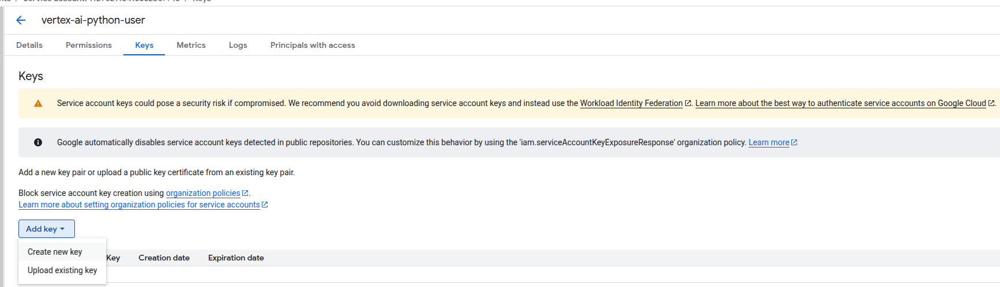

- Um arquivo .json será baixado no seu computador, com suas credenciais. É muito importante que não as exponha no seu repositório, por esse motivo no `.gitignore` deste projeto, é ignorado qualquer arquivo .json.
