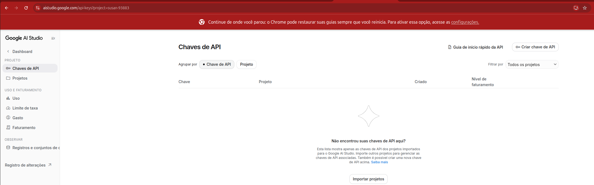
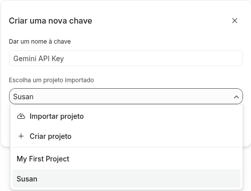
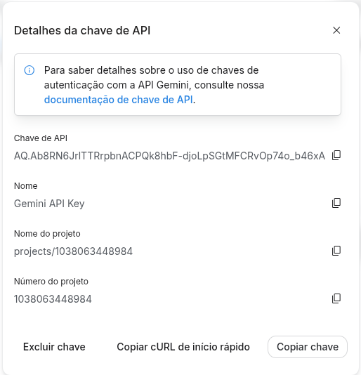

# GEMINIAPIKEY
Para desenvolvimento local, prototipagem, testar ideias, criar scripts, estudar ou desenvolver agents no terminal/Jupyter Notebook sem complicação de IAM. Ou seja, sem precisar criar um projeto, configurar o acesso e as roles no IAM.

## Vantagens do uso do GEMINIAPIKEY (AI Studio) com relação ao Vertex (principais)
Aqui vou listar algumas vantagens do AI Studio ante ao Vertex, no contexto atual, onde vamos iniciar e explorar um pouco do uso dos modelos de IA Gemini para a criação de agentes. 
A principal vantagem vem da extrema facilidade, no foco em usar apenas o Gemini, não precisando se preocupar em criar um projeto, uma fatura, etc, para finalmente poder criar o seu agente. Então, para o caso de testes, mvps e afins, a criação de agentes por meio do AI Studio, é de grande valia. Uma burocracia bem reduzida, e um nível gratuito bastante confortável, são outras das vantagens que vamos aproveitar no nosso caso.

## Desvantagens do uso do GEMINIAPIKEY (AI Studio) com relação ao Vertex (principais)
Muito limitado. A falta de recursos, por exemplo, "quero usar um bucket, ou um banco de dados", isso torna necessário que criemos um projeto cloud, fazendo com que o uso do AI Studio torne-se irrelevante. A Gemini API Key não possui as mesmas garantias de tempo de atividade, sendo mais propensa a oscilações ou falhas intermitentes de concorrência em picos de tráfego. Ou seja, erros de instabilidade do agente, são muito mais frequentes do que utilizando o Vertex.

## Como criar uma chave?
- 1 • Acesse o Google AI Studio e faça login com a sua conta Google.
    - 

- 2 • Clique no botão "Criar chave de API" (ou Create API key), localizado no canto superior direito da tela.

- 3 • Escolha se deseja associar a chave a um projeto existente ou criar um novo projeto, definindo um nome de identificação para facilitar o controle.
    - 

- 4 • Clique em "Criar chave" para finalizar.

- 6 • Copie o código alfanumérico gerado e guarde-o em um local seguro, pois ele não será exibido por completo novamente
    - 

## Como executar?
- ## 1. Clone o repositório:
    - git clone https://github.com/DadosComCafe/genai_gcp_study

- ## 2. Configure o ambiente e instale as dependências do python:
    - cd 1.Usando\ a\ GeminiApiKey/hello_world_geminiapikey/
    - uv sync

- ## 3. Variáveis de ambiente
    - Utilize o arquivo .env_sample, para criar um arquivo .env que possua as mesmas chaves
    - Apenas isso

- ## 4. Finalmente, execute main.py
    - uv run main.py

## Referências Oficiais
- __AI Studio__: https://aistudio.google.com/

- __Documentação Oficial__: https://ai.google.dev/gemini-api/docs/api-key?hl=pt-br

- __Guia de Início Rápido__: https://aistudio.google.com/docs/get-started